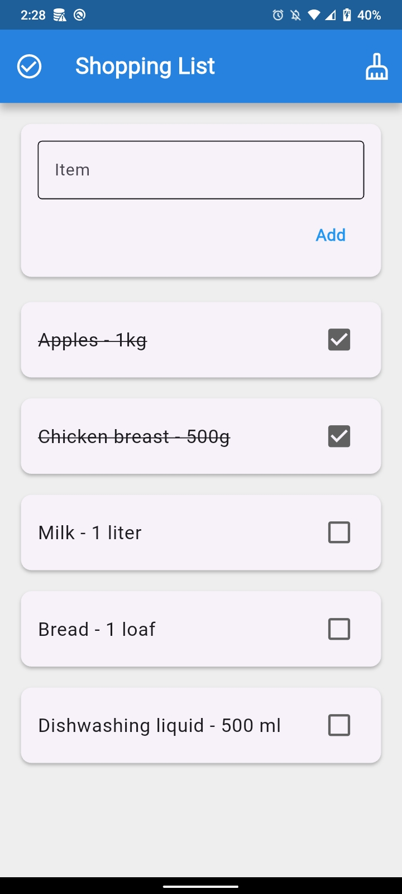

# 🛒 Shopping List

A clean, persistent shopping list app built with **Flutter** and **Realm**, designed for fast item management with offline-first local storage.

---

## 📱 Features

- **Add items** — Quickly add grocery or shopping items via a text input
- **Check/uncheck items** — Tap the checkbox to mark items as done (with strikethrough styling)
- **Check all / Uncheck all** — Toggle all items at once from the app bar
- **Sweep** — Delete all checked items in one tap with the cleanup button
- **Persistent storage** — All data is saved locally via Realm, surviving app restarts

---

## 🛠️ Tech Stack

| Technology | Purpose |
|---|---|
| [Flutter](https://flutter.dev) | UI framework |
| [Dart](https://dart.dev) | Programming language |
| [Realm](https://www.mongodb.com/docs/realm/sdk/flutter/) | Local database / persistence |

---

## 🚀 Getting Started

### Prerequisites

- [Flutter SDK](https://docs.flutter.dev/get-started/install) (3.0+)
- Dart SDK (bundled with Flutter)
- A connected device or emulator

### Installation

1. **Clone the repository**
   ```bash
   git clone https://github.com/your-username/shopping-list.git
   cd shopping-list
   ```

2. **Install dependencies**
   ```bash
   flutter pub get
   ```

3. **Generate Realm model files**
   ```bash
   dart run realm generate
   ```

4. **Run the app**
   ```bash
   flutter run
   ```

---

## 📁 Project Structure

```
lib/
├── main.dart          # App entry point, UI and state logic
├── items.dart         # Realm model definition
└── items.realm.dart   # Auto-generated Realm code (do not edit)
```

---

## 🗂️ Data Model

The app uses a single Realm object to represent each list item:

```dart
@RealmModel()
class _Items {
  late String itemName;  // The display name of the item
  late bool isChecked;   // Whether the item has been checked off
}
```


---

## 🎯 Learning Outcome

This assignment strengthened understanding of:

- Local database persistence in Flutter
- Data modeling with Realm
- UI interaction handling
- Clean project structuring for version control

---

## 📸 Screenshots




---


## 📄 License

This project is licensed under the [MIT License](LICENSE).
